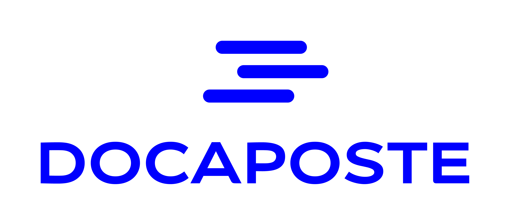
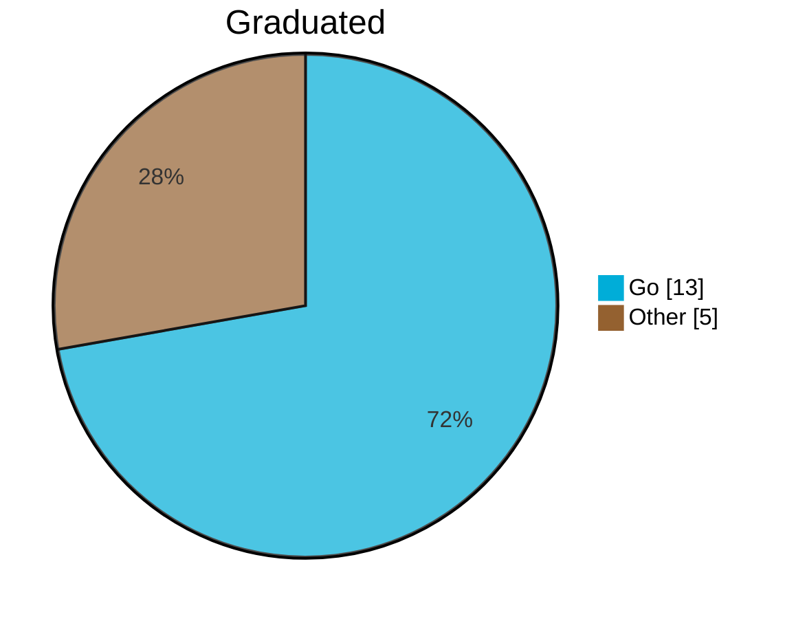
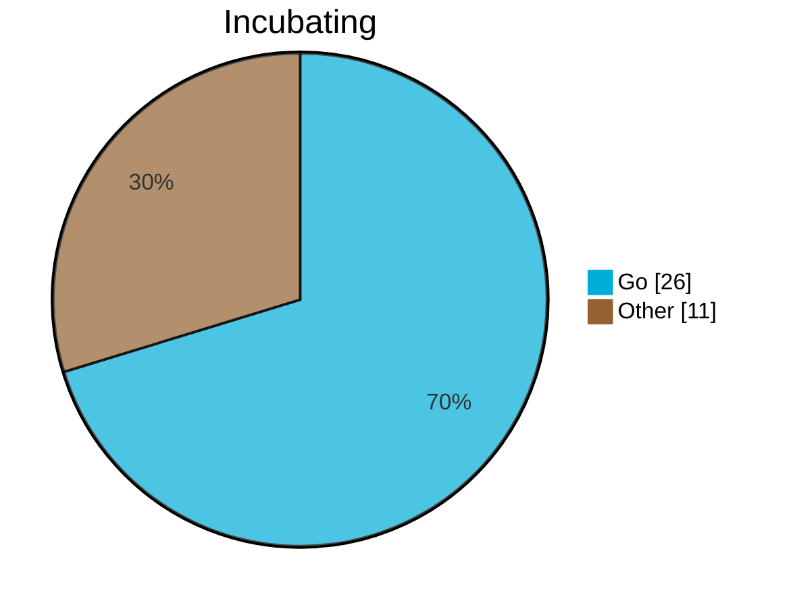
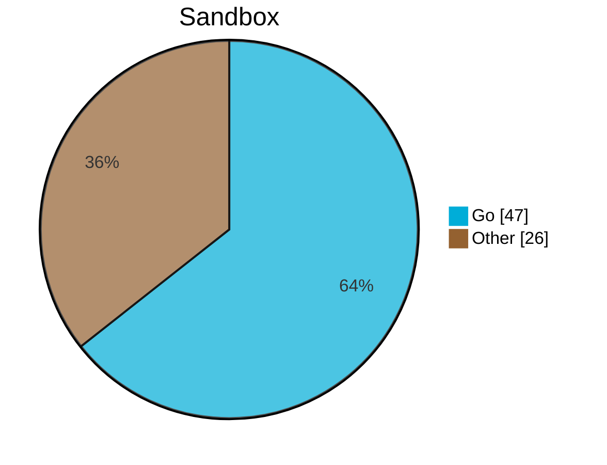
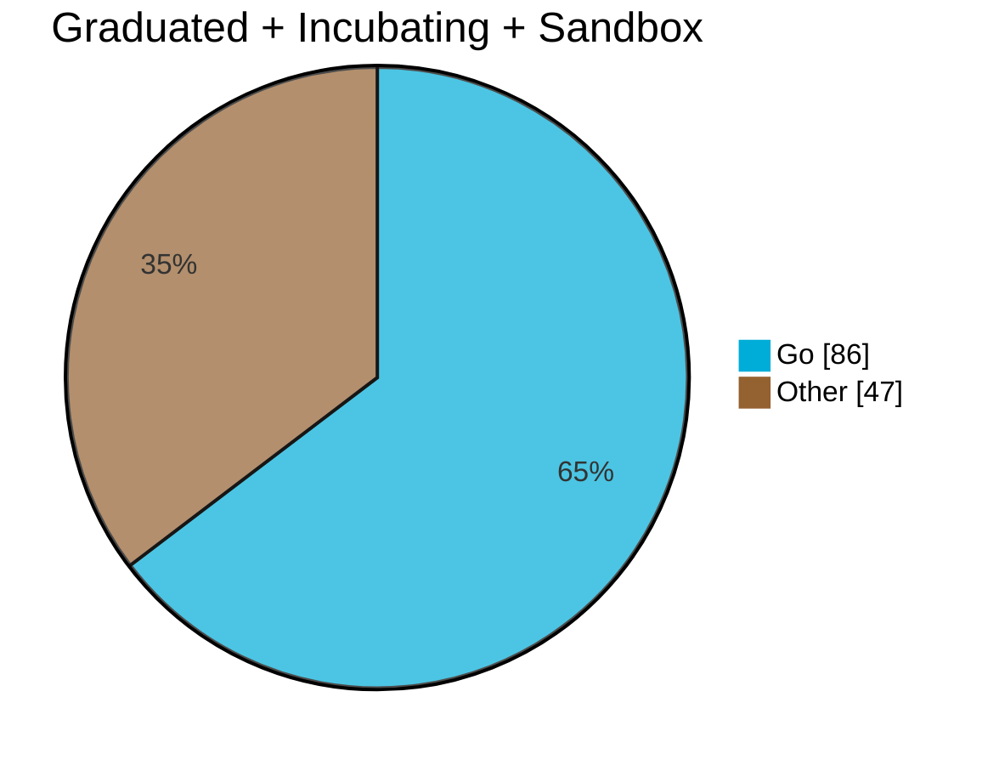
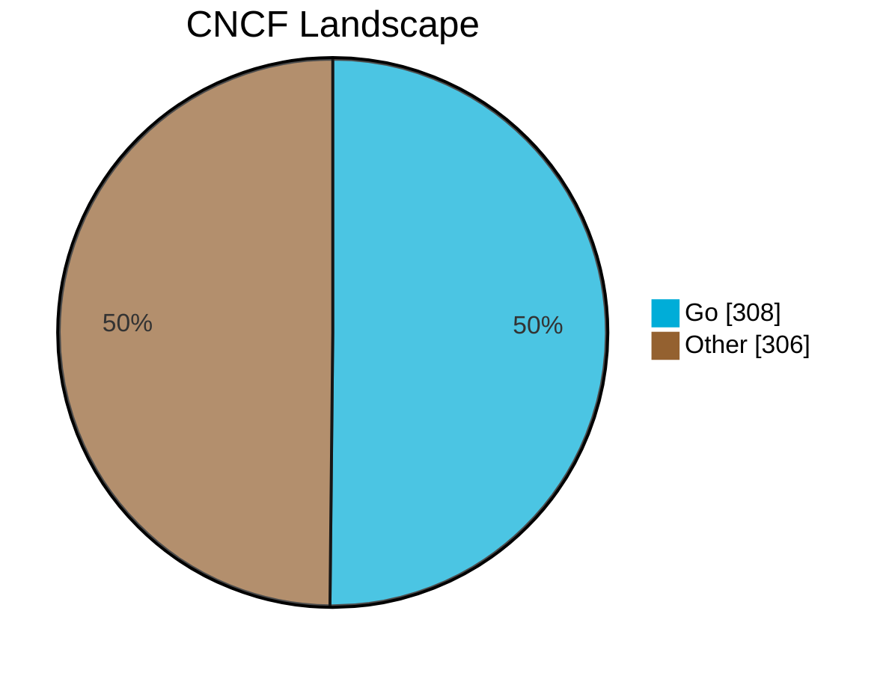
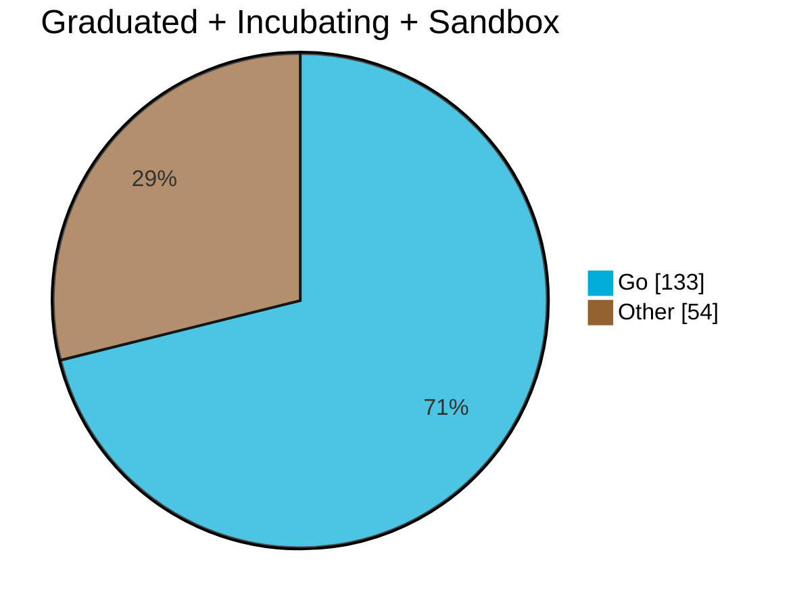

# It's time to Go

JUG Łódź, Bartosz Paluszkiewicz


---
layout: intro
---



---

## Gaming Secure Vault - international presence

- Germany (2 regulations)
- France
- Colombia
- Bulgaria
- Portugal
- Switzerland
- Denmark
- Greece
- Netherlands
- Romania
- Argentina
- Spain

---
layout: cover
---

# Did you Go there?

<!--
1. Who has heard about Go?
2. Who has used tools written in Go? Names? (Docker, Kubernetes, Terraform, etc.)
3. Who has written Go?
4. Who has used Go in production? Why?

-->

---

# Is it used though?

28.08.2022, source: [https://gloutnikov.com/post/cncf-language-stats/](https://gloutnikov.com/post/cncf-language-stats/)

<div class="flex items-center h-full">







</div>

---

# Is it used though?

28.08.2022, source: [https://gloutnikov.com/post/cncf-language-stats/](https://gloutnikov.com/post/cncf-language-stats/)



<!--
Actually read it from source: https://raw.githubusercontent.com/jrhenderson1988/jrhenderson1988.github.io/master/_posts/2023-07-16-cncf-projects-by-language.md
-->

---

# Is it used though?

16.07.2023,
source: [https://jonathonhenderson.co.uk/2023/07/16/cncf-projects-by-language](https://jonathonhenderson.co.uk/2023/07/16/cncf-projects-by-language)



<!--
It is LANDSCAPE, not open source projects you can contribute into.
Compare the numbers - 614 projects here vs. 128 on a previous slide.
-->

--- 

# Is it used though?

[CNCF contributors](https://contribute.cncf.io/contributors/)

```shell
curl "https://raw.githubusercontent.com/cncf/tag-contributor-strategy/main/website/data/projects.json" \
| jq '[.[] | select(.language != null)] | group_by(.language)[] | {key:.[0].language, count: length}'
```



---

# What is Go?

1. Statically typed
2. Compiled (AOT)
3. Garbage collected
4. Highly concurrent
5. Simple (not always easy)
6. Fast
7. Open Source
8. Backed by Google

<!--
- designed at Google in 2007
- publicly announced in November 2009
- first release (1.0) in March 2012

The goals were:
- static typing
- runtime efficiency (like C)
- readability and usability (like Python)
- high performance networking and concurrency

The reason was dislike of C++.
-->

---

# Go simple

```plaintext
break        default      func         interface    select
case         defer        go           map          struct
chan         else         goto         package      switch
const        fallthrough  if           range        type
continue     for          import       return       var
```

<div style="height: 30px"></div>

```plaintext
abstract   continue   for          new         switch
assert     default    if           package     synchronized
boolean    do         goto         private     this
break      double     implements   protected   throw
byte       else       import       public      throws
case       enum       instanceof   return      transient
catch      extends    int          short       try
char       final      interface    static      void
class      finally    long         strictfp    volatile
const      float      native       super       while
_ (underscore)

exports      opens      requires     uses   yield
module       permits    sealed       var         
non-sealed   provides   to           when        
open         record     transitive   with        
```

<!--
Go new words:
- chan
- defer
- fallthrough
- go
- range
- select
- struct
- type

'missing' in Go:
- class/extends/implements/abstract
- final
- private/protected/public
- try/catch/finally
- throw/throws


The Second group in Java are Contextual keywords - may be interpreted as keywords or as other tokens, depending on the context in which they appear. 
Source: https://docs.oracle.com/javase/specs/jls/se21/html/jls-3.html#jls-3.9
-->

---

# Go vs Java (tooling)

### Go SDK

- go build
- go generate
- go test
- go tool cover
- go fmt
- go vet
- go get github.com/google/uuid
- go mod tidy

<!--

Java:
- javac
- Maven/Gradle
- JUnit (Spock?)
- Maven plugins
  - linting
  - formatting
  - everything

-->
---

# Go vs Java (tooling)

### Experimental

- tools
    - godoc
    - gopls
    - imports
- vulncheck

---

# Go vs Java (tooling)

### External build tools

- make
- task

---

# Let's Go see the code

```go {all|1|3|4|all}{lines:true}
package main

func main() {
	println("Hello, World!")
}
```

<p v-if="$slidev.nav.clicks >= 4" v-motion>

> $ Hello, World!

</p>


---

# Syntax 101

<div style="padding:1rem">
```go {0|1|2|0}
var go1 string = "gopher"
go2 := "gopher"
```

```go{0|all|0}
type User struct {
    login string
}
```

```go {0|all|1|2|1,3,4|11,12|0}
func login(login, password string) (User, error) {
  if login != "admin" {
    err := fmt.Errorf("unknown user: %s", login)
    return User{}, err
}

  if password != "admin" {
      return User{}, fmt.Errorf("wrong password")
  }
  
  u := User{login:login}
  return u, nil
} 
```

</div>


<!--
Left

Explicit type declaration can be useful for using default values
Or when you need to assign value implementing an interface to variable of interface
type.
Think: List l = new ArrayList();
-->


---
layout: two-cols-header
---

# Syntax 102

::left::

<div style="padding: 1rem">
```go {0|all|0}
var int i = 1
var int8 i8 = 1
var int16 i16 = 1
var int32 i32 = 1
var int64 i64 = 1
var uint ui = 1
var uint8 ui8 = 1
var uint16 ui16 = 1
var uint32 ui32 = 1
var uint64 ui64 = 1
var uintptr up = 1
var byte b = 1 // alias for uint8
// represents a Unicode code point
var rune r = 'a' // alias for int32
```
</div>

::right::

<div style="padding: 1rem">
```go {0|all|0}
var float32 f32 = 1.0
var float64 f64 = 1.0
```

```go {0|all|0}
var complex64 c64 = 9 + 11i
var complex128 c128 = complex(21, 37)
``` 

```go {0|all|0}
var bool b = true
var string s = "gopher" // alias for []byte
```

</div>


<!--
When you need an integer value you should use int 
unless you have a specific reason 
to use a sized or unsigned integer type.
-->

---

# Syntax 103

```go {all|1,2,3|5,6,7|all|0}
people := map[string]Person{
    "admin": Person{"Gopher"},
}

for k, v := range people {
    fmt.Printf("%s: %s\n", k, v.Name)
}
```

```go {0|all|1|2|6|all|0}
switch os := runtime.GOOS; os {
  case "darwin":
     fmt.Println("Apple")
  case "linux":
     fmt.Println("Penguin")
  default:
     fmt.Println("Nobody cares")
}
```

---

# Syntax 104

```go {all|6|all|0}
const admin = "admin"
people := map[string]Person{
  admin: Person{"Gopher"},
}

if adm, ok := people[admin]; ok {
    fmt.Printf("Admin is here, %s\n", adm.Name)
} else {
    people[admin] = Person{"default"}
}
```

```go {0|all|0}
type Reader interface {
    Read(b []byte) (n int, err error)
}
```

```go {0|all|0}
type HandlerFunc func (r ResponseWriter, w *Request)
```

---
layout: center
---

# Let's Go see some REAL code

---
layout: two-cols-header
---

# Go proverbs

https://go-proverbs.github.io/

::left::

- Don't communicate by sharing memory, share memory by communicating.
- Concurrency is not parallelism.
- Channels orchestrate; mutexes serialize.
- The bigger the interface, the weaker the abstraction.
- Make the zero value useful.
- interface{} says nothing.
- Gofmt's style is no one's favorite, yet gofmt is everyone's favorite.
- A little copying is better than a little dependency.
- Syscall must always be guarded with build tags.

::right::

- Cgo must always be guarded with build tags.
- Cgo is not Go.
- With the unsafe package there are no guarantees.
- Clear is better than clever.
- Reflection is never clear.
- Errors are values.
- Don't just check errors, handle them gracefully.
- Design the architecture, name the components, document the details.
- Documentation is for users.
- Don't panic.

<!--
proverb=przysłowie

jest ich 19
-->

---
layout: center
---

# Don't communicate by sharing memory, share memory by communicating.


<v-click>

```go {all|1|3|5|all}
c := make(chan string)
go func () {
c <- "ping"
}()
println(<-c)
```

</v-click>


<!--
- direction and position of arrows
- like BlockingLinkedQueue
- can be buffered
-->

---
layout: center
---

# The bigger the interface, the weaker the abstraction.

```go
type Reader interface {
Read(p []byte) (n int, err error)
}

type Closer interface {
Close() error
}

type ReadCloser interface {
Reader
Closer
}
```

---
layout: two-cols
---

# Credits

- Gophers illustrations by [MariaLetta](https://github.com/MariaLetta/free-gophers-pack/tree/master)
- Copilot by [GitHub](https://copilot.github.com/)

::right::

# Further reading

- [A tour of Go](https://go.dev/tour/welcome/1)
- [Effective Go](https://go.dev/doc/effective_go)
- [The Go blog](https://go.dev/blog/)
- YouTube [Go Class](https://www.youtube.com/watch?v=iDQAZEJK8lI&list=PLoILbKo9rG3skRCj37Kn5Zj803hhiuRK6)
  by [Matt Holiday](https://github.com/matt4biz/go-class-slides/blob/trunk/xmas-2020/README.md)
- [100 Go mistakes and how to avoid them](https://100go.co/)
- [Uber Go guide](https://github.com/uber-go/guide/blob/master/style.md)
- [Go style guide](https://google.github.io/styleguide/go/)
- [Three Dots Tech blog](https://threedots.tech/start/)

